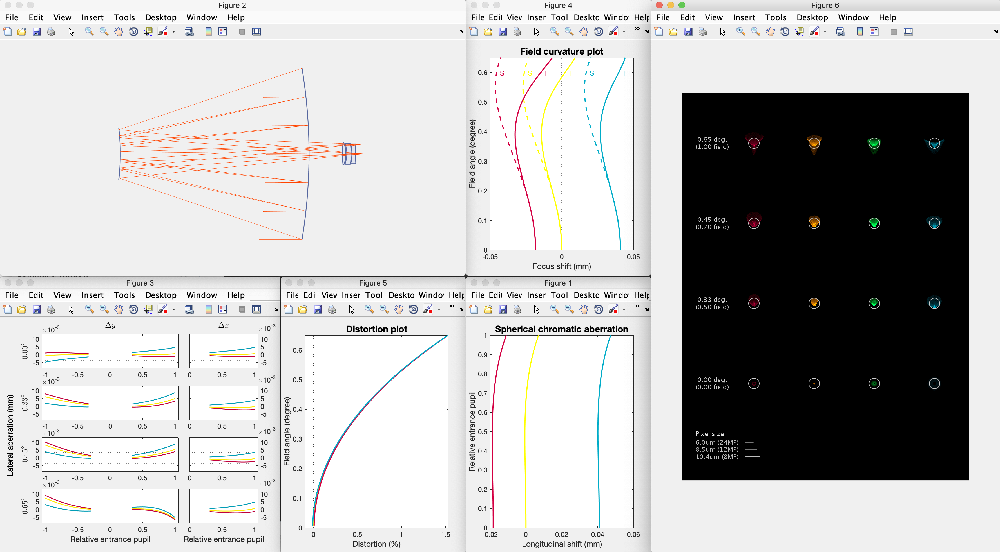

# Optical System Simulation

This is a toy simulation for an optical system. It is written in MATLAB.
In order to run the test scripts, you need to add this folder to MATLAB's path.

**NOTE**: Some functions are based on my another project
[Color Science Utils](https://github.com/LoveDaisy/ColorScienceUtils).
You'd better clone it and add it into your MATLAB's path before you run this repository.

## Features

* All spherical/conical surfaces system.
* All 3rd order aberration.
* All aberration plots (ray fan plot, spot plot, etc.) based on real ray tracing.
* Optimization ability.
* OOP programing style.

A screenshot of some charts.



## Quick start

See `examples/doublet_main.m` for detail.
Here are some brief introductions.

To get spectral lines, function `get_fraunhofer_line` is helpful.

```matlab
d_line = get_fraunhofer_line('d');
F_line = get_fraunhofer_line('F');
C_line = get_fraunhofer_line('C');
```

Use class `OpticalSystem` to build up your system, with given surface curvatures and thicknesses.

```matlab
c_array = [9.3730e-4, -1.2959e-3, -1.2959e-3, -2.4094e-4];
t_array = [18, 0.3, 10, 2000];
sys = OpticalSystem(c_array, t_array, {'N-BK7', 'AIR', 'F2', 'AIR'});
```

The system can solve height for every surface, according to given F-number and field angle.
All heights are determined so that no surface stops light at its edge.

```matlab
sys = sys.solveApertureHeight(f_number, field_angle);
```

Show some charts, including system profile, some aberration charts, etc.

```matlab
sys.plotShapeProfile('ShowRays', false);

sys.plotLsa({'d', 'C', 'F', 'e', 'g', 'r'}, 'xlim', [-6, 6], 'ShowLegend', true);

sys.plotRayFan([d_line, C_line, F_line, e_line, g_line, r_line], ...
    [0, 0.5, 1] * field_angle, image_curvature);

sys.plotSpotDiagram([C_line, d_line, e_line, F_line], field_angle * [0, 0.3, 0.5, 1.0], ...
    'ImageCurv', image_curvature, 'WidthLength', 600e-3);
```

---

I'll write a tutorial when I have time.

Please feel free to cantact me if you have any question.
